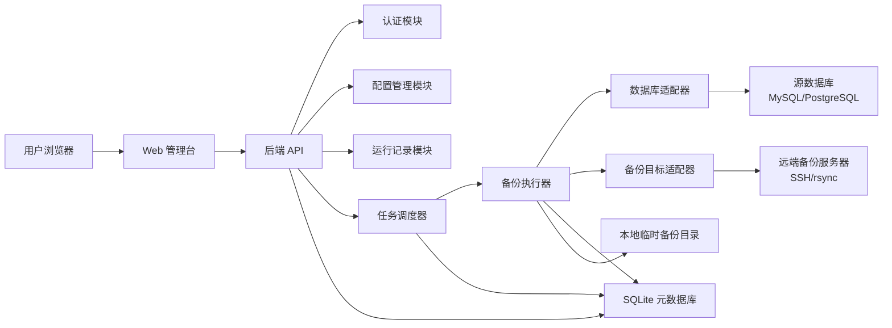
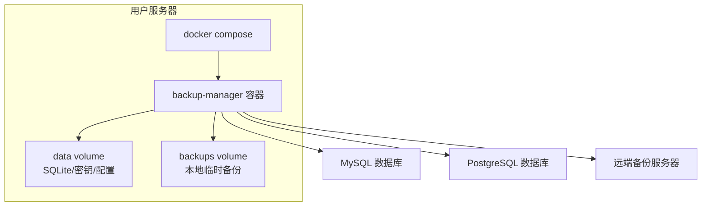
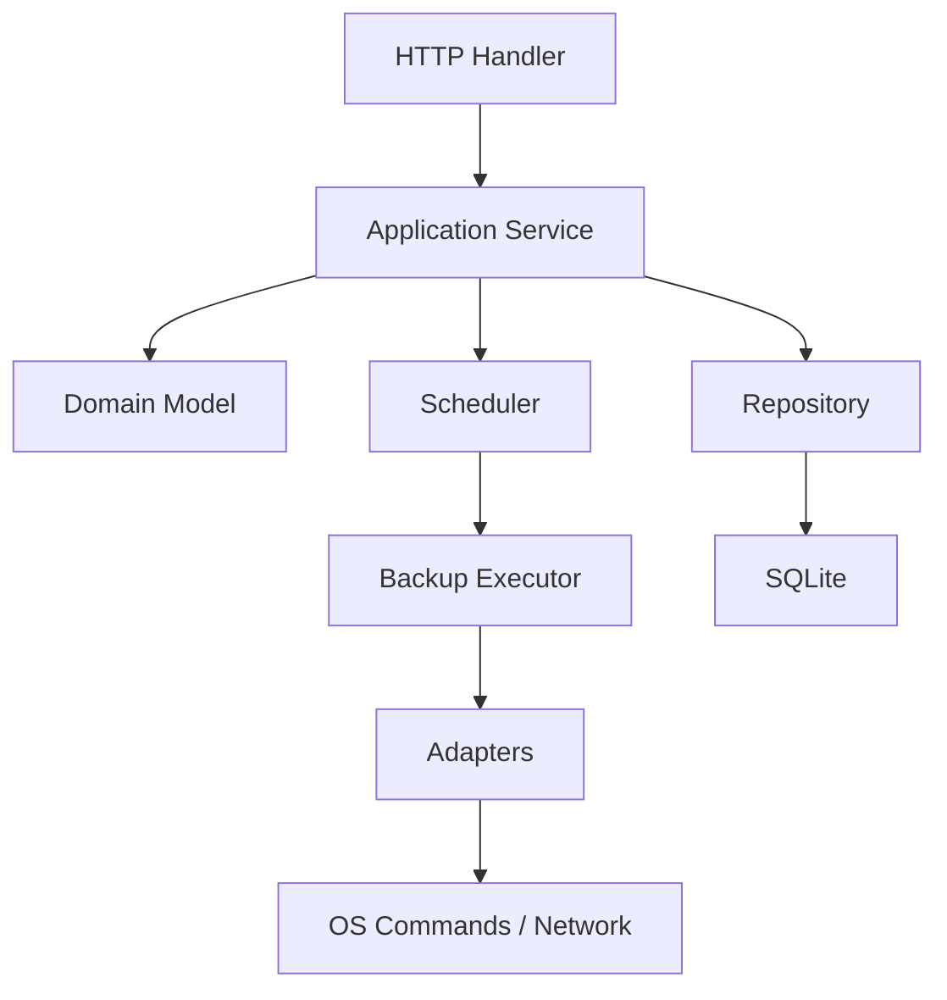
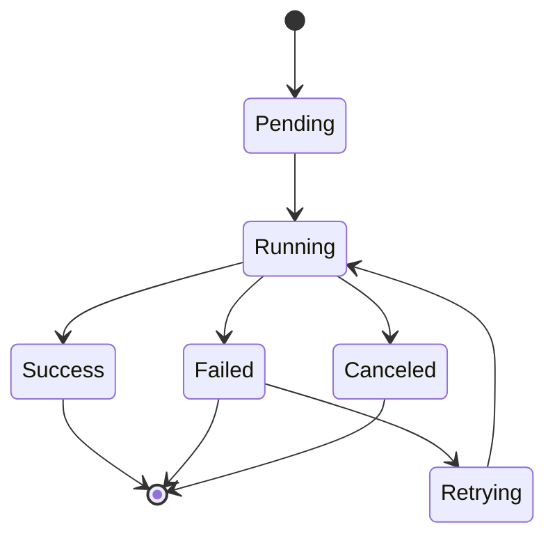
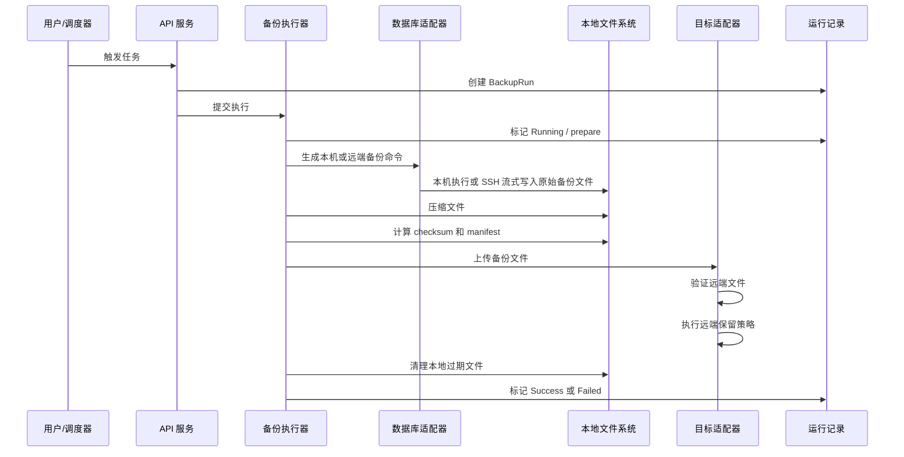

# 数据库备份管理台架构设计

## 1. 架构目标

数据库备份管理台是一个面向用户自部署场景的 Web 应用，用于配置并执行数据库定时备份，将备份文件上传到远端服务器，并提供任务状态、运行记录和错误日志。

架构设计目标：

- 部署简单：用户通过 Docker Compose 启动。
- 运行可靠：备份任务可追踪、可重试、可排查。
- 安全可控：敏感信息加密保存，备份数据不经过中心化平台。
- 易于扩展：通过适配器扩展数据库类型和备份目标类型。
- 第一版足够轻量：采用单体服务和 SQLite，避免引入复杂基础设施。

## 2. 总体架构

第一版采用自部署单体架构。



核心说明：

- Web 管理台使用 React、Vite 和 TypeScript 构建，生产产物由后端单体服务托管，并通过 HTTP API 管理数据源、备份目标、备份任务和运行记录。
- 调度器负责按计划触发任务。
- 备份执行器负责一次完整备份流程。
- 数据库适配器负责不同数据库的连接测试、库列表读取和备份命令生成。
- 备份目标适配器负责上传、远端校验和远端保留策略。
- SQLite 保存配置和运行元数据，不保存真实备份文件。

## 3. 部署架构

### 3.1 Docker Compose 拓扑



第一版只需要一个主应用容器：

- 对外暴露 Web 端口，例如 `8080`。
- 挂载 `/app/data` 保存 SQLite、加密配置和应用状态。
- 挂载 `/app/backups` 保存备份执行过程中的临时文件。
- 通过网络访问源数据库和远端备份服务器。

### 3.2 容器内依赖

主应用镜像构建时会先使用 Node/pnpm 构建前端，再构建 Rust 后端；最终运行镜像只内置运行所需组件：

- 应用后端二进制。
- `web/dist/` 前端静态资源。
- `mysqldump`。
- `mysqladmin`。
- `mysql`。
- `pg_dump`。
- `psql`。
- `sqlcmd`，用于 SQL Server 连接测试和数据库列表查询。
- `sqlpackage`，用于 SQL Server `.bacpac` 导出。
- `openssh-client`。
- `rsync`。
- `sshpass`，用于 SSH 密码认证目标的非交互式上传。
- `gzip` 或 `zstd`。
- `sha256sum`。

本地或自定义镜像运行时，如果这些客户端工具不在 `PATH` 中，可以通过环境变量覆盖可执行文件路径：

- `MYSQLDUMP_PATH`：MySQL 备份导出工具路径，默认 `mysqldump`。
- `MYSQLADMIN_PATH`：MySQL 连接测试工具路径，默认 `mysqladmin`。
- `MYSQL_PATH`：MySQL 数据库列表查询工具路径，默认 `mysql`。
- `PG_DUMP_PATH`：PostgreSQL 备份导出工具路径，默认 `pg_dump`。
- `PSQL_PATH`：PostgreSQL 连接测试和数据库列表查询工具路径，默认 `psql`。
- `SQLCMD_PATH`：SQL Server 连接测试和数据库列表查询工具路径，默认 `sqlcmd`。
- `SQLPACKAGE_PATH`：SQL Server `.bacpac` 备份导出工具路径，默认 `sqlpackage`。

对于达梦、Oracle 等客户端授权或安装复杂的数据库，架构预留外挂客户端目录。SQL Server 的 `sqlcmd` 和 `sqlpackage` 也可按同样方式挂载：

- 用户将客户端工具挂载到容器内，例如 `/opt/db-clients/dameng`。
- 数据库适配器配置客户端命令路径。
- 执行器使用配置路径调用客户端工具。

### 3.3 本地启动流程

本地运行分为两种模式。

后端托管前端构建产物的完整启动流程：

```bash
cp .env.example .env
cd web
pnpm install
pnpm build
cd ..
cargo run -p backup-manager
```

此模式下访问 `http://127.0.0.1:8080`。Rust 服务会托管 `web/dist/`，适合验证接近生产环境的单体部署效果。

前端开发联调流程：

```bash
# 终端一：启动后端 API
cargo run -p backup-manager

# 终端二：启动前端开发服务器
cd web
pnpm install
pnpm dev
```

此模式下访问 Vite 默认地址 `http://127.0.0.1:5173`。Vite 会将 `/api` 代理到 `VITE_API_PROXY_TARGET` 指向的后端地址，未配置时默认代理到 `http://127.0.0.1:8080`，用于前端热更新开发。生产环境和 Docker Compose 不使用 Vite 开发服务器。

Docker Compose 启动流程：

```bash
cd deploy
docker compose up --build
```

Docker 构建阶段会自动安装前端依赖并执行 `pnpm build`，最终运行镜像只复制 Rust 二进制和 `web/dist/` 静态资源。

### 3.4 运行配置分层

后端运行配置由 `.env` 和进程环境变量提供。`BIND_ADDR` 控制后端监听地址，`BACKUPS_DIR` 控制服务本机临时备份目录，`DEFAULT_TARGET_BASE_DIR` 控制新建备份目标时前端表单展示的默认远端目录。

前端生产包不直接读取 `.env` 中的业务默认值，而是在启动后调用 `/api/config/public` 获取可公开的运行配置。该接口只返回前端安全可见的信息，例如监听地址和表单默认值，不返回管理员密码、`APP_SECRET`、SQLite 路径等敏感配置。

Vite 开发服务器的 API 代理属于开发期配置，通过 `web/.env` 中的 `VITE_API_PROXY_TARGET` 设置；未配置时默认代理到 `http://127.0.0.1:8080`。

## 4. 后端逻辑架构

后端采用 Rust 实现，推荐基于 `axum`、`tokio`、`sqlx` 和 `tracing` 构建。Rust 负责 API 服务、任务调度、备份执行、外部命令管理、SQLite 持久化和敏感信息加密。

后端建议分为以下层次：



### 4.1 HTTP Handler

职责：

- 处理登录和鉴权。
- 接收 Web 管理台请求。
- 做基础参数校验。
- 返回统一错误格式。

不应在 Handler 中执行备份命令或直接拼接数据库命令。

### 4.2 Application Service

职责：

- 编排业务用例。
- 创建、更新、删除数据源、备份目标和备份任务。
- 测试数据库连接和备份目标连接。
- 基于已保存的数据源读取可备份数据库列表，供备份任务表单下拉选择；如果读取失败，前端允许用户手动输入数据库名。
- 触发立即备份。
- 查询仪表盘数据和运行记录。

### 4.3 Repository

职责：

- 封装 SQLite 读写。
- 提供配置、任务、运行记录、日志记录的持久化接口。
- 保证外层业务不直接依赖 SQL 细节。

### 4.4 Scheduler

职责：

- 加载启用状态的备份任务。
- 根据 cron 表达式或每日执行时间计算下一次运行时间。
- 到期后创建运行记录并交给执行器。
- 应用启动时重新加载任务。
- 任务变更后刷新调度。

调度器不直接执行数据库备份命令，只负责触发执行器。

### 4.5 Backup Executor

职责：

- 控制一次备份的完整生命周期。
- 防止同一任务并发执行。
- 调用数据库适配器生成备份。
- 根据数据源执行模式选择本机导出或远端 SSH 导出。
- 压缩文件并计算 checksum。
- 调用目标适配器上传文件。
- 应用保留策略。
- 更新运行状态和日志。

## 5. 核心数据模型

### 5.1 DatabaseConnection

表示一个源数据库连接。

关键字段：

- `id`
- `name`
- `type`
- `host`
- `port`
- `username`
- `encrypted_password`
- `database`
- `execution_mode`：`local` 或 `remoteSsh`，默认 `local`
- `remote_host`
- `remote_port`
- `remote_username`
- `remote_auth_method`
- `encrypted_remote_secret`
- `remote_tool_path`
- `remote_working_dir`
- `config_json`
- `created_at`
- `updated_at`

`config_json` 保存数据库类型专属配置，例如 PostgreSQL 的 `sslmode`，后续达梦的模式名、字符集或客户端路径。

`execution_mode` 控制备份工具在哪台机器执行。默认 `local` 表示管理台本机执行 `mysqldump` 或 `pg_dump`；`remoteSsh` 表示通过 SSH 登录数据库服务器，在远端执行数据库导出工具，并将 stdout 流式写入管理台本机临时备份文件。远端 SSH 密码或私钥必须使用 `encrypted_remote_secret` 加密保存。

### 5.2 BackupTarget

表示一个备份目标。

关键字段：

- `id`
- `name`
- `type`
- `host`
- `port`
- `username`
- `encrypted_secret`
- `base_dir`
- `config_json`
- `created_at`
- `updated_at`

第一版 `type` 为 `ssh`。

### 5.3 BackupJob

表示一个定时备份任务。

关键字段：

- `id`
- `name`
- `database_connection_id`
- `database_name`
- `backup_target_id`
- `schedule`
- `compression`
- `remote_retention_days`
- `local_retention_days`
- `enabled`
- `created_at`
- `updated_at`

### 5.4 BackupRun

表示一次备份运行。

关键字段：

- `id`
- `backup_job_id`
- `status`
- `stage`
- `started_at`
- `finished_at`
- `duration_ms`
- `raw_file_name`
- `archive_file_name`
- `file_size`
- `checksum`
- `remote_path`
- `error_message`
- `created_at`

### 5.5 BackupRunLog

保存执行日志。

关键字段：

- `id`
- `backup_run_id`
- `timestamp`
- `level`
- `stage`
- `message`

## 6. 备份任务状态机



状态说明：

- `Pending`：运行记录已创建，等待执行。
- `Running`：正在执行备份。
- `Success`：备份、上传和校验均成功。
- `Failed`：任一阶段失败。
- `Retrying`：后续版本可支持自动重试。
- `Canceled`：后续版本可支持手动取消。

第一版可以只实现 `Pending`、`Running`、`Success`、`Failed`。

执行阶段建议使用：

- `prepare`
- `dump`
- `compress`
- `checksum`
- `upload`
- `verify_remote`
- `remote_retention`
- `local_cleanup`
- `done`

页面展示失败时，应显示当前 `stage` 和 `error_message`。

## 7. 备份执行时序



## 8. 适配器架构

### 8.1 数据库适配器

数据库适配器用于隔离不同数据库的差异。

```rust
#[async_trait::async_trait]
pub trait DatabaseAdapter: Send + Sync {
    fn db_type(&self) -> &'static str;
    fn display_name(&self) -> &'static str;
    fn config_schema(&self) -> DatabaseConfigSchema;
    fn validate_config(&self, config: &DatabaseConfig) -> anyhow::Result<()>;
    async fn test_connection(&self, config: &DatabaseConfig) -> anyhow::Result<()>;
    async fn list_databases(&self, config: &DatabaseConfig) -> anyhow::Result<Vec<String>>;
    fn build_backup_command(&self, job: &BackupJob, output_path: &Path) -> anyhow::Result<BackupCommand>;
    fn build_restore_hint(&self, backup: &BackupRun) -> String;
}
```

适配器注册方式：

```rust
registry.register(Arc::new(MySqlAdapter::new()));
registry.register(Arc::new(PostgresAdapter::new()));
```

业务层通过 `type` 查找适配器：

```rust
let adapter = registry.get(&connection.db_type)?;
```

新增达梦数据库时，应新增独立包：

```text
crates/backup-manager/src/adapters/database/dameng
```

不应修改备份执行器主流程。

### 8.2 备份目标适配器

备份目标也应采用适配器模式，第一版实现 SSH。

```rust
#[async_trait::async_trait]
pub trait BackupTargetAdapter: Send + Sync {
    fn target_type(&self) -> &'static str;
    fn display_name(&self) -> &'static str;
    fn config_schema(&self) -> TargetConfigSchema;
    fn validate_config(&self, config: &TargetConfig) -> anyhow::Result<()>;
    async fn test_connection(&self, config: &TargetConfig) -> anyhow::Result<()>;
    async fn upload(&self, req: UploadRequest) -> anyhow::Result<UploadResult>;
    async fn verify(&self, req: VerifyRequest) -> anyhow::Result<()>;
    async fn apply_retention(&self, req: RetentionRequest) -> anyhow::Result<()>;
}
```

后续支持 S3、OSS、COS、MinIO 时，只新增目标适配器。

## 9. 动态配置 Schema

为了支持多数据库扩展，前端表单应由后端 schema 驱动。

Schema 示例：

```json
{
  "type": "mysql",
  "displayName": "MySQL",
  "fields": [
    { "name": "host", "label": "主机", "type": "text", "required": true },
    { "name": "port", "label": "端口", "type": "number", "default": 3306 },
    { "name": "username", "label": "用户名", "type": "text", "required": true },
    { "name": "password", "label": "密码", "type": "password", "required": true },
    { "name": "database", "label": "默认数据库", "type": "text" }
  ]
}
```

前端根据 schema 渲染表单并提交统一结构，后端由对应适配器校验。

## 10. 安全架构

### 10.1 认证与会话

第一版采用单管理员登录：

- 管理员用户名和初始密码通过环境变量设置。
- 登录成功后签发会话 token。
- API 统一校验 token。

### 10.2 敏感信息加密

敏感信息入库前必须加密：

- 数据库密码。
- SSH 私钥。
- SSH 密码。
- 未来对象存储 access key。

加密密钥由 `APP_SECRET` 派生。

### 10.3 命令执行约束

备份命令必须使用参数数组执行：

```rust
tokio::process::Command::new(&command.program)
    .args(&command.args)
    .output()
    .await?;
```

禁止用字符串拼接后交给 shell 执行，避免命令注入。

### 10.4 权限建议

部署文档应要求：

- 不使用 root 数据库账号备份。
- 不使用 root SSH 账号上传。
- 备份服务器目录只授予备份用户写入权限。
- 生产环境必须使用 HTTPS 或放在可信内网后面。

## 11. 错误处理与可观测性

统一错误格式：

```json
{
  "code": "BACKUP_UPLOAD_FAILED",
  "message": "备份文件上传失败",
  "detail": "rsync exited with code 12"
}
```

运行日志要求：

- 每个执行阶段都写入日志。
- 外部命令的 stderr 需要采集并截断保存。
- 失败时记录命令名称、退出码和安全处理后的错误输出。
- 页面可以按任务和运行记录查看日志。

第一版观测方式：

- Web 页面状态和日志。
- 容器 stdout 日志。
- SQLite 运行记录。

后续可扩展：

- Prometheus metrics。
- Webhook 通知。
- 邮件和 IM 通知。

## 12. 目录与文件规范

本地临时目录：

```text
/app/backups/<job-id>/<run-id>/
```

远端备份目录：

```text
<base-dir>/<source-server>/<db-type>/<database-name>/<yyyy-mm-dd>/
```

一次备份生成文件：

```text
database_2026-05-14_020000.dump
database_2026-05-14_020000.dump.gz
database_2026-05-14_020000.dump.gz.sha256
manifest.json
```

`manifest.json` 建议包含：

- 数据库类型。
- 数据库名称。
- 任务名称。
- 运行 ID。
- 备份开始和结束时间。
- 文件大小。
- checksum。
- 应用版本。

## 13. 第一版推荐代码结构

如果使用 Rust，推荐结构如下：

```text
Cargo.toml
crates/backup-manager/
crates/backup-manager/src/main.rs
crates/backup-manager/src/api/
crates/backup-manager/src/auth/
crates/backup-manager/src/config/
crates/backup-manager/src/domain/
crates/backup-manager/src/repository/
crates/backup-manager/src/scheduler/
crates/backup-manager/src/executor/
crates/backup-manager/src/adapters/database/mysql/
crates/backup-manager/src/adapters/database/postgres/
crates/backup-manager/src/adapters/target/ssh/
crates/backup-manager/src/crypto/
crates/backup-manager/src/logging/
web/
deploy/
docs/
```

结构原则：

- `api` 只处理 HTTP。
- `domain` 放核心模型和状态枚举。
- `executor` 放备份主流程。
- `adapters` 放数据库和目标端差异。
- `repository` 隔离 SQLite。
- `web` 放 React 前端工程，生产构建产物输出到 `web/dist/`。
- `deploy` 放 Dockerfile、docker-compose 和示例配置。

推荐 Rust 依赖：

- `axum`：HTTP API 和静态资源托管。
- `tokio`：异步运行时、任务调度和外部命令执行。
- `sqlx`：SQLite 访问和迁移。
- `serde` / `serde_json`：配置、API 和 manifest 序列化。
- `tracing` / `tracing-subscriber`：结构化日志。
- `anyhow` / `thiserror`：错误处理。
- `async-trait`：适配器 trait 的异步方法。
- `aes-gcm` / `argon2` / `rand`：敏感信息加密和密码处理。
- `tokio-cron-scheduler`：定时任务。

## 14. 架构演进

### V1：自部署单体

- 单容器应用。
- SQLite。
- MySQL 和 PostgreSQL。
- SSH 备份目标。
- 每日全量备份。

### V2：更多适配器

- 达梦数据库。
- SQL Server。
- S3/OSS/COS/MinIO。
- 通知适配器。
- 一键恢复。

### V3：Agent 架构

当用户需要统一管理多台服务器时，可以演进为中心管理端加 Agent：

- 管理端负责配置、监控和审计。
- Agent 安装在数据库所在服务器。
- Agent 本地执行备份，避免数据库暴露到管理端。
- 管理端和 Agent 通过安全通道通信。

第一版不直接实现 Agent 架构，但当前适配器和执行器设计应避免和单机部署强绑定。
